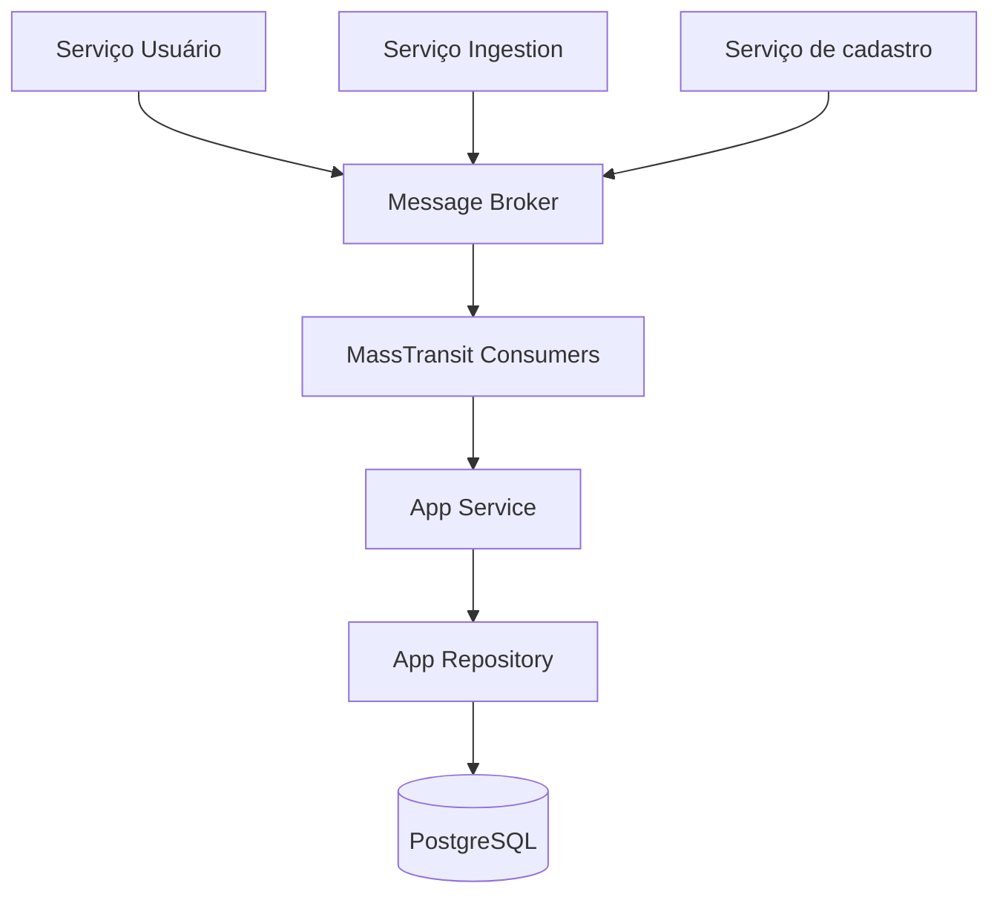

```mermaid
    flowchart TD

    User[Serviço Usuário]
    Ingestion[Serviço Ingestion]
    Register[Serviço de cadastro]
    Broker[Message Broker]
    Consumer[MassTransit Consumers]
    Repository[App Repository]
    Service[App Service]
    Database[(PostgreSQL)]

    User --> Broker
    Ingestion --> Broker
    Register --> Broker

    Broker --> Consumer
    Consumer --> Service
    Service --> Repository
    Repository --> Database
        
```