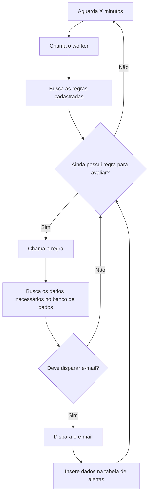

```mermaid
    flowchart TD

    A[Aguarda X minutos]
    B[Chama o worker]
    C[Busca as regras cadastradas]
    D{Ainda possui regra para avaliar?}
    E[Chama a regra]
    F[Busca os dados necessários no banco de dados]
    G{Deve disparar e-mail?}
    H[Dispara o e-mail]
    I[Insere dados na tabela de alertas]


    A --> B
    B --> C
    C --> D
    D --> |Sim| E
    D --> |Não| A
    E --> F
    F --> G
    G --> |Sim| H
    H --> I
    I --> D
    G --> |Não| D
        
```